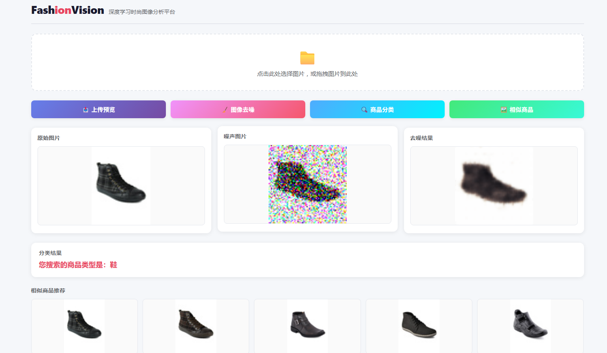

# FashionVision · 深度学习时尚图像分析平台

> 基于 PyTorch 的时尚商品图像智能分析平台，集成**图像分类**、**图像去噪**、**以图搜图**三大核心功能，并提供交互式 Web 界面。

[](https://www.python.org/)
[](https://pytorch.org/)
[](https://flask.palletsprojects.com/)
[](LICENSE)

---

## 📑 目录

- [概述](#-概述)
- [功能特性](#-功能特性)
- [界面预览](#-界面预览)
- [项目结构](#-项目结构)
- [模型架构](#-模型架构)
- [数据集](#-数据集)
- [快速开始](#-快速开始)
- [配置说明](#-配置说明)
- [预训练模型](#-预训练模型)
- [技术栈](#️-技术栈)
- [贡献](#-贡献)
- [许可证](#-许可证)

---

## 📖 概述

FashionVision 是一个端到端的深度学习应用，聚焦时尚商品图像理解中的三个基础任务。每个任务以独立模块实现，遵循统一的 **config → data → model → engine → train** 管线，代码结构清晰、易于扩展。

平台内置预训练模型权重，无需额外训练即可直接启动 Web 界面，开箱即用。

---

## ✨ 功能特性

| 功能 | 说明 | 技术方案 |
|---|---|---|
| 🔍 **图像分类** | 识别时尚商品所属类别（共 5 类） | CNN 分类器 + 5 路 Softmax |
| 🧹 **图像去噪** | 去除高斯噪声，还原清晰图像 | 卷积去噪自编码器 |
| 🖼️ **以图搜图** | 上传图片，从图库中检索最相似的 Top-K 商品 | 深度卷积编码器 + 余弦 KNN 检索 |

所有功能通过单页 Web 应用统一提供，支持拖拽上传。

---

## 🎬 界面预览



---

## 📂 项目结构

```
imge_processing/
├── common/                        # 公共模块
│   ├── utils.py                   # 工具函数（随机种子、文件排序）
│   ├── fashion-labels.csv         # 24,854 条分类标签
│   └── dataset/                   # 图片数据集（需自行下载）
│       └── *.jpg
│
├── image_class/                   # 🔍 图像分类
│   ├── classification_model.py    # CNN 分类器定义
│   ├── classification_engine.py   # 训练与评估循环
│   ├── classification_data.py     # 数据集与 DataLoader
│   ├── classification_config.py   # 超参数配置
│   ├── classification_train.py    # 训练入口
│   ├── classification_test.py     # 推理测试脚本
│   └── classifier.pt              # 预训练权重
│
├── image_denoising/               # 🧹 图像去噪
│   ├── denoising_model.py         # 去噪自编码器定义
│   ├── denoising_engine.py        # 训练与评估循环
│   ├── denoising_data.py          # 加噪数据集生成
│   ├── denoising_config.py        # 超参数配置
│   ├── denoising_train.py         # 训练入口
│   ├── denoising_test.py          # 推理测试脚本
│   └── denoiser.pt                # 预训练权重
│
├── image_similiar/                # 🖼️ 以图搜图
│   ├── similarity_model.py        # 深度卷积编码器 / 解码器
│   ├── similarity_engine.py       # 训练、嵌入生成、KNN 检索
│   ├── similarity_data.py         # 自监督数据集（目标 = 输入）
│   ├── similarity_config.py       # 超参数配置
│   ├── similarity_train.py        # 训练入口
│   ├── similarity_test.py         # 推理与可视化
│   ├── deep_encoder.pt            # 预训练编码器权重
│   └── data_embedding_f.npy       # 全量图像嵌入矩阵（~97 MB）
│
├── web/                           # 🌐 Web 应用
│   ├── web_app.py                 # Flask 后端（端口 9000）
│   ├── templates/
│   │   └── index.html             # 现代化单页 UI
│   ├── pictures/                  # 页面图标资源
│   └── __init__.py
│
├── imgs__display/                 # 📸 展示截图
│   └── all_function.png
│
└── test/                          # Jupyter Notebook 测试
    ├── 1_apple_test.ipynb
    ├── classification_test.ipynb
    ├── denoising_test.ipynb
    └── autoencoder.pth
```

---

## 🧠 模型架构

### 图像分类 — CNN 分类器
```
Conv(3→8, k=3)  → ReLU → MaxPool(2)
Conv(8→16, k=3) → ReLU → MaxPool(2)
Flatten → Linear(16×16×16 → 5)
```
| 参数 | 值 |
|---|---|
| 输入 | 64×64 RGB |
| 输出 | 5 类 softmax |
| 类别 | 上衣 / 鞋 / 包 / 裤子 / 手表 |
| 损失函数 | 交叉熵 (Cross-Entropy) |
| 优化器 | AdamW (lr=1e-3, weight_decay=1e-4) |

### 图像去噪 — 卷积自编码器
```
编码器: Conv(3→32) → Conv(32→16) → Conv(16→8)    [+ReLU + MaxPool 每层]
解码器: ConvTranspose(8→8) → ConvTranspose(8→16) → ConvTranspose(16→32) → Conv(32→3)
```
| 参数 | 值 |
|---|---|
| 输入 / 输出 | 68×68 RGB |
| 噪声类型 | 高斯噪声 (μ=0, σ=0.5) |
| 损失函数 | 均方误差 (MSE) |
| 优化器 | AdamW (lr=1e-3) |

### 以图搜图 — 深度编码器 + KNN
```
编码器: 5 × [Conv → ReLU → MaxPool(2)]   (通道: 3 → 16 → 32 → 64 → 128 → 256)
解码器: 5 × [ConvTranspose → ReLU] + Sigmoid
```
| 参数 | 值 |
|---|---|
| 嵌入维度 | 256 × 2 × 2 = 1024 |
| 检索方式 | 余弦相似度 + KNN (k=5) |
| 训练策略 | 自监督重建（输入 = 目标） |
| 损失函数 | 均方误差 (MSE) |

---

## 📊 数据集

本项目使用 Kaggle 上的 **[Fashion Product Images](https://www.kaggle.com/datasets/paramaggarwal/fashion-product-images-dataset)** 数据集：

| 指标 | 值 |
|---|---|
| 图片总数 | ~24,854 张 |
| 类别数 | 5（上衣、鞋、包、裤子、手表） |
| 标签文件 | `common/fashion-labels.csv` |
| 图片格式 | JPEG，分辨率不一 |

> **数据准备：** 将数据集图片放入 `common/dataset/` 目录下，确保文件名与 `fashion-labels.csv` 中的 `id` 列一致。

---

## 🚀 快速开始

### 环境要求

- **Python** 3.8 或更高版本
- **PyTorch** 2.0+（推荐 CUDA 12.1 以启用 GPU 训练）
- **内存** ≥ 8 GB，**显存** ≥ 4 GB（GPU 训练）

### 安装

```bash
# 1. 克隆仓库
git clone https://github.com/XiaoFeiCode/imge_processing.git
cd imge_processing

# 2. 创建并激活虚拟环境
python -m venv venv

# Windows:
venv\Scripts\activate
# Linux / macOS:
source venv/bin/activate

# 3. 安装依赖
pip install -r requirements.txt
```

### 准备数据集

1. 从 Kaggle 下载 [Fashion Product Images](https://www.kaggle.com/datasets/paramaggarwal/fashion-product-images-dataset)。
2. 将图片解压到 `common/dataset/` 目录。
3. 确认 `common/fashion-labels.csv` 已存在。

### 训练模型

各模块可独立训练：

```bash
# 训练去噪自编码器
python -m image_denoising.denoising_train

# 训练图像分类器
python -m image_class.classification_train

# 训练以图搜图编码器并生成嵌入向量
python -m image_similiar.similarity_train
```

训练完成后，模型权重会自动保存到对应模块目录下。

### 启动 Web 应用

```bash
python -m web.web_app
```

浏览器访问 **http://localhost:9000** 即可使用，界面提供四项操作：

1. **上传图片** — 点击上传区或拖拽图片即可预览。
2. **图像去噪** — 点击「🧹 图像去噪」，对比加噪图与去噪还原结果。
3. **商品分类** — 点击「🔍 商品分类」，显示预测的商品类别。
4. **相似商品** — 点击「🖼️ 相似商品」，展示 Top-5 最相似商品图。

---

## ⚙️ 配置说明

各模块的 `*_config.py` 文件集中管理所有可调参数：

| 参数 | 分类 | 去噪 | 以图搜图 | 说明 |
|---|---|---|---|---|
| `IMG_HEIGHT × IMG_WIDTH` | 64 × 64 | 68 × 68 | 64 × 64 | 输入图像尺寸 |
| `SEED` | 42 | 42 | 42 | 随机种子（可复现） |
| `LEARNING_RATE` | 1e-3 | 1e-3 | 1e-3 | AdamW 学习率 |
| `EPOCHS` | 10 | 20 | 10 | 训练轮次 |
| `TRAIN_BATCH_SIZE` | 32 | 32 | 32 | 批次大小 |
| `TRAIN_RATIO` | 0.80 | 0.75 | 0.80 | 训练集占比 |

---

## 📦 预训练模型

仓库内已包含基于 Fashion Product Images 数据集训练好的模型权重，无需训练即可直接推理：

| 文件 | 所属模块 | 大小 | 说明 |
|---|---|---|---|
| `image_class/classifier.pt` | 分类 | ~89 KB | CNN 分类器 |
| `image_denoising/denoiser.pt` | 去噪 | ~48 KB | 去噪自编码器 |
| `image_similiar/deep_encoder.pt` | 以图搜图 | ~1.5 MB | 卷积编码器 |
| `image_similiar/data_embedding_f.npy` | 以图搜图 | ~97 MB | 全量图像嵌入向量库 |

---

## 🛠️ 技术栈

| 层级 | 技术 |
|---|---|
| **深度学习** | PyTorch 2.0+、torchvision |
| **后端** | Flask 3.0+ |
| **前端** | HTML5、CSS3、原生 JavaScript（渐变主题现代化 UI） |
| **数值计算** | NumPy、scikit-learn |
| **图像处理** | Pillow (PIL) |
| **训练辅助** | tqdm、pandas |

---

## 🤝 贡献

欢迎提交 Issue 和 Pull Request！如有问题或改进建议，请在 [GitHub Issues](https://github.com/XiaoFeiCode/imge_processing/issues) 中提出。

---

## 📄 许可证

本项目基于 [MIT License](LICENSE) 开源。

---

<p align="center">
  <sub>Built with ❤️ and PyTorch</sub>
</p>
